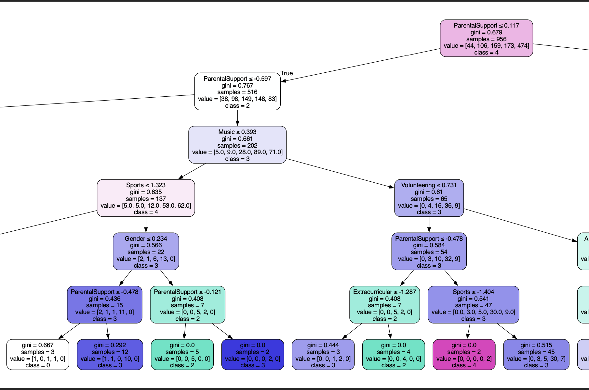

# Student Performance Classification 

## NON-TECHNICAL EXPLANATION OF YOUR PROJECT
The project has to aims. The first one is to help identify what aspects are the most important when aiming for a good grade among students. The second one is to accuratly classify in which class grade a student would fall given certain criterias. So, whoever uses this model could understand how their current school effort would rank them and where to put more effort in. For instance, if the model predicts that student who volunteer get better grades then one might consider doing this. 

## DATA
The project uses a dataset that contains comprehensive information on 2,392 high school students, detailing their demographics, study habits, parental involvement, extracurricular activities, and academic performance. The target variable, GradeClass, classifies students' grades into distinct categories, providing a robust dataset for educational research, predictive modeling, and statistical analysis. 
This data stems from Kaggle and is synthetic data. 

CitationL @misc{rabie_el_kharoua_2024,
	title={ Students Performance Dataset },
	url={https://www.kaggle.com/ds/5195702},
	DOI={10.34740/KAGGLE/DS/5195702},
	publisher={Kaggle},
	author={Rabie El Kharoua},
	year={2024}

## MODEL 
A summary of the model you’re using and why you chose it. 

The model I am using is a decision tree. Each node classifies a student into one of the 5 available grades. 
I picked this model since it was the best balance between accuracy and interpretation. Given the aim of the project it was important for me that a non technical user could understand the results and make decisions based on them. Other options such as random forests and KNN would have given higher accuracy but their interpretation could never be as clear a the decision tree. 

## HYPERPARAMETER OPTIMSATION
Description of which hyperparameters you have and how you chose to optimise them. 

max_depth = 15:
Limits the maximum depth of the tree to prevent overfitting by controlling model complexity. Chosen by experimenting with different depths and selecting the value that balanced training accuracy and validation performance.

max_features = 'sqrt':
At each split, considers the square root of the total features to introduce randomness and reduce correlation between splits, helping to improve generalization.

min_samples_leaf = 2:
Ensures that each leaf node has at least 2 samples, which smooths the model by preventing overly specific splits on very small subsets.

min_samples_split = 5:
Requires a minimum of 5 samples to split an internal node, which avoids creating nodes that are too small and potentially noisy.

criterion = 'entropy':
Uses information gain based on entropy to decide the best splits, encouraging more informative partitions compared to the default Gini impurity.

random_state = 2:
Fixes the random seed for reproducibility of results.

I used a gridsearch to get to these tunings for all the hyperparameters except for the criterion. The criterion was tuned by hand since there were only two options: entropy and gini. Entropy performed better in the end. 

## RESULTS
A summary of your results and what you can learn from your model 

My results were a good balance between accuracy and interpretation. The accuracy for the test data was almost 70% which I was satisfied with. What one can learn from the model is what elements are most important when wanting to achieve a higher grade. Also, one could learn how they are performing based on what class they are classified in given their own academic characteristics. 

Below can be seen an example of a decision tree and how to interpret it: 

You can include images of plots using the code below:

Interpretation of the final nodes: the combination of features that led to that node show that students that have that specific combination of features are more likely to be in a certain class. 

Gini close to 0 = mostly or completely one class.

Gini close to 0.5 or more = mixed classes. So this combination of features gives random results and should not be focused on when deciding how to get the best grades.

Value = tells us how the training data was distributed at that node.

Class = X is what the tree will predict for any sample reaching this node.
